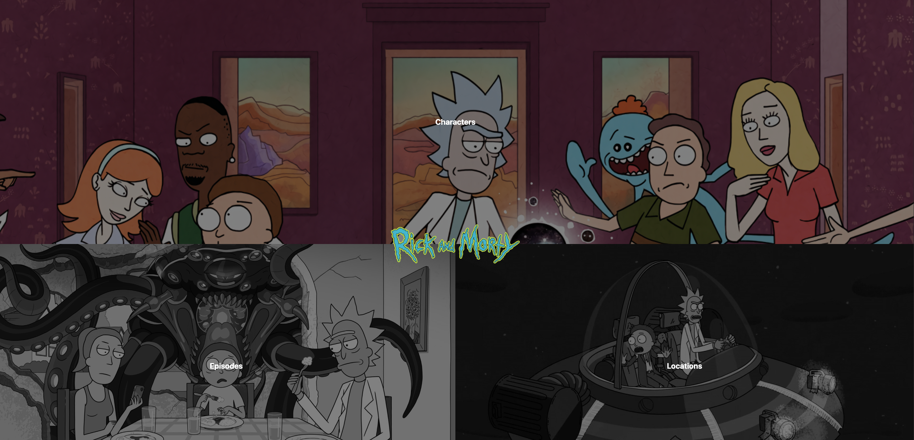

# Rick and Morty Info

This project is a Next.js web app that displays details of characters from the Rick and Morty show. It fetches data from the Rick and Morty API and displays it in a user-friendly way.

# Table of Contents

1. Screenshots
2. Features
3. Tech stack
4. Author

# Screen Shot

# Features

1. List characters from the Rick and Morty show
2. Search for a specific character by name
3. View details of a character, including name, image, status, gender, location, origin, species, and episode

# Tech stack

1. Next.js: ===> A framework for building server-rendered React apps
2. TypeScript:===> A typed superset of JavaScript
3. React: ===> A JavaScript library for building user interfaces
4. Tailwind CSS: ===> A utility-first CSS framework
5. Rick and Morty API:===> A free JSON REST API for data from the Rick and Morty show

# Author

DIALLO Mamadou Samba ❤️‍🔥❤️‍🔥❤️‍🔥❤️‍🔥❤️‍🔥❤️‍🔥❤️‍🔥❤️‍🔥❤️‍🔥
